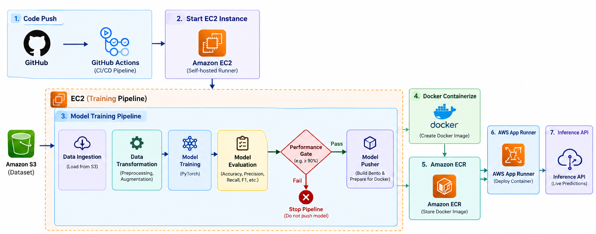

# X-ray Lung Classifier

An end-to-end computer vision and MLOps project that classifies chest X-ray images into `NORMAL` and `PNEUMONIA` classes.


## Overview

The project combines a PyTorch CNN with a modular training pipeline, Amazon S3 data ingestion, automated evaluation, BentoML model serving, Docker containerization, Amazon ECR, and GitHub Actions.

The latest local training run achieved **95.22% test accuracy** on `1,171` test images. Accuracy alone is not sufficient for medical use, so the evaluation pipeline also records precision, recall, F1-score, and a confusion matrix.

Evaluation metrics:

- accuracy=95.22%
- precision=96.51%
- recall=96.96%
- f1=96.73%
- confusion_matrix=[[286, 30], [26, 829]]

## Architecture



The model is pushed only when it passes the configured minimum accuracy threshold, currently `90%`.

## Project Structure

```text
.
├── app.py                         # Local FastAPI fallback API
├── train.py                       # Training pipeline entry point
├── bentofile.yaml                 # BentoML build and container config
├── requirements.txt               # Verified runtime dependencies
├── .github/workflows/             # CI/CD and continuous-training workflow
├── docs/                          # Architecture and project documentation
├── scripts/                       # Runner and environment scripts
├── notebook/                      # Experiments and investigations
├── flowcharts/                    # Design and pipeline diagrams
├── xray/
│   ├── components/
│   │   ├── data_ingestion.py      # Download training data from Amazon S3
│   │   ├── data_transformation.py # Augment images and create DataLoaders
│   │   ├── model_training.py      # Train and register the PyTorch CNN
│   │   ├── model_evaluation.py    # Calculate metrics and confusion matrix
│   │   └── model_pusher.py        # Build, containerize, and push the model
│   ├── entity/                    # Pipeline artifacts and configuration
│   │   ├── artifacts_entity.py    # Outputs exchanged between components
│   │   └── config_entity.py        # Component and pipeline configuration
│   ├── ml/model/                  # CNN architecture and BentoML service
│   └── pipeline/                  # End-to-end training orchestration
├── data/                          # Local dataset, generated and ignored
├── artifacts/                     # Timestamped outputs, generated and ignored
└── logs/                          # Runtime logs, generated and ignored
```

The generated directories are kept at the repository root because the pipeline writes to these paths. They are excluded from version control; the source layout and documentation remain clean without changing runtime behavior.

## Technology

- Python 3.10+ for local development
- PyTorch and Torchvision
- FastAPI for the local fallback API
- BentoML 1.4.39 for model packaging and serving
- Docker for containerization
- Amazon S3 for training data
- Amazon ECR for container images
- GitHub Actions with AWS OIDC authentication

## Setup

Create and activate the virtual environment, then install the pinned dependencies:

```powershell
python -m venv .venv
.\.venv\Scripts\Activate.ps1
python -m pip install -r requirements.txt
```

The training pipeline expects AWS credentials with access to the configured S3 bucket. Verify the AWS identity before running it:

```powershell
aws sts get-caller-identity
```

## Train And Package

Run the complete pipeline:

```powershell
python train.py
```

The pipeline performs these steps:

1. Downloads the dataset from Amazon S3.
2. Applies separate training and test transforms.
3. Trains the PyTorch CNN.
4. Evaluates accuracy, precision, recall, F1-score, and confusion matrix.
5. Stops before deployment if accuracy is below the quality threshold.
6. Builds the BentoML service and Docker image.
7. Logs in to Amazon ECR and pushes the image when AWS access and the repository are available.

The ECR repository must exist before the push step:

```powershell
aws ecr create-repository --repository-name xray_bento_image --region us-east-1
```

## Run The Container Locally

The pipeline produces the local image `xray_bento_image:latest`:

```powershell
docker run --rm -p 3000:3000 xray_bento_image:latest
```

The BentoML service is then available at `http://localhost:3000`.

## Local FastAPI Fallback

The fallback API loads `MODEL_PATH` when provided. Otherwise it selects the newest pipeline-generated model artifact:

```powershell
uvicorn app:app --reload
```

Send an image to the prediction endpoint:

```powershell
curl.exe -X POST "http://127.0.0.1:8000/predict" -F "file=@path\to\xray.jpg"
```

Example response:

```json
{
  "prediction_index": 1,
  "prediction_label": "Pneumonia"
}
```

## Deployment Workflow

The intended deployment flow is:

```text
GitHub Actions
	-> AWS OIDC role
	-> EC2 training runner
	-> S3 dataset
	-> BentoML and Docker
	-> Amazon ECR
```

The workflow uses short-lived AWS credentials through GitHub OIDC. Configure the required repository secrets, including `AWS_ROLE_ARN`, AWS region, EC2 runner settings, and the GitHub runner token, before enabling continuous training.

## Dataset Layout

The dataset follows the `ImageFolder` layout:

```text
data/
├── train/
│   ├── NORMAL/
│   └── PNEUMONIA/
└── test/
	├── NORMAL/
	└── PNEUMONIA/
```

More detail is available in [docs/architecture.md](docs/architecture.md).
